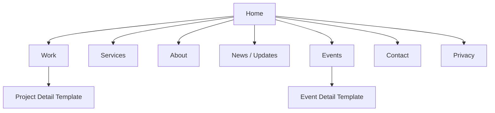
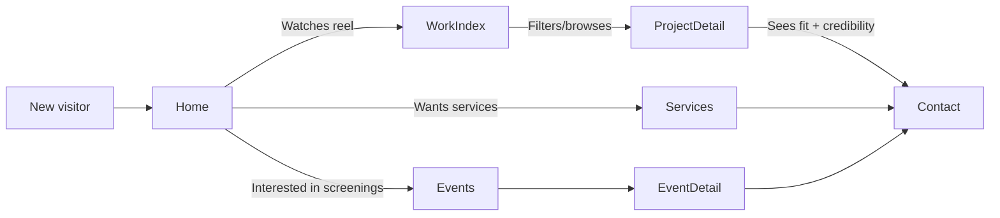

# Chile Line Media Website Rebuild Research Report

## Executive Summary

Chile Line Media presents publicly as a film and media production company founded by “a collective of young filmmakers” and based in **Albuquerque, New Mexico**. citeturn13search22turn14search3 The public footprint emphasizes narrative storytelling rooted in Northern New Mexico culture and place—especially through the short film *The Way We Carry Water*, which is repeatedly described in terms of land, heritage, acequia communities, family, grief, and renewal. citeturn46search0turn46search15turn41view0

Two official/primary-source channels strongly shape the brand story and should be treated as “content anchors” for a redesigned site:

- An entity["organization","New Mexico Film Office","state film office nm"] production announcement and production page for *The Way We Carry Water* (director/producer credits; synopsis; contact email). citeturn46search0turn46search15turn41view2  
- The *Completed Project Report* entry listing Chile Line Media LLC as production company and providing office/accounting contact details. citeturn41view3

Key constraint discovered during research: the current website at the provided URL returned **no extractable text content** to the browsing tool, preventing reliable enumeration of pages, metadata, and SEO configuration via normal crawling. citeturn4view0 This is itself a critical risk for discoverability (indexing), accessibility, and maintainability, and it strongly argues for a rebuild approach that produces server-rendered, indexable HTML with explicit metadata, a sitemap, and structured data.

From competitor benchmarking, the strongest local patterns are “portfolio-first” production sites featuring: (a) a showreel or featured work above the fold, (b) a dedicated “Work”/“Commercials”/“Film & TV” section, (c) strong trust signals (awards, client logos, press), and (d) a low-friction contact CTA. citeturn16view0turn17view0turn47view0turn47view1turn47view2

The recommended new site strategy is to build a **portfolio + credibility + lead capture** system with a flexible CMS so your team can continuously publish projects, stills, credits, screenings, and announcements—while automatically reusing social/video embeds without letting them become the “primary home” of your work.

## Source Audit and Inventory

### Current website inventory and crawlability

The current site URL could be opened but yielded **zero parsed lines** in the browsing tool, which prevents a conventional page crawl and makes it impossible (from this tooling) to produce a complete list of existing pages, titles, descriptions, Open Graph tags, or internal linking structure. citeturn4view0

**Actionable implication:** treat the rebuild as not just a visual redesign, but a technical correction that ensures:

- Pages produce indexable HTML (server-rendered or static generation).
- Each page has explicit `<title>`, meta description, canonical URL, Open Graph tags, and (where relevant) schema.org structured data.
- A sitemap is generated and submitted to entity["company","Google","search provider"] Search Console.
- Media is optimized for performance (especially video embeds).

#### Site inventory table (what could be verified)

| Area | URL | Content type | Status in this research | Notes / likely issues |
|---|---|---|---|---|
| Home | chilelinemedia.com | Marketing/portfolio hub | **Not machine-readable via current tool** citeturn4view0 | Could indicate heavy client-side rendering, bot-blocking, or minimal HTML payload—each can harm SEO and accessibility if not handled with SSR and proper metadata. |

**Unspecified / missing information (requires internal confirmation):** existing page list; existing DNS/hosting; current CMS; current analytics; conversions; newsletter tooling; brand guidelines and logo files.

### Social media and public profile inventory

The only clearly verifiable “official” profile surfaced consistently during this research is the Instagram account; YouTube presence is indicated in prior search results but could not be fully opened due to platform throttling during this session. citeturn13search22turn0search5

| Platform | Public profile | Evidence of positioning | Observable content formats | Notes |
|---|---|---|---|---|
| entity["company","Instagram","social media platform"] | @chilelinemedia | “Film and Media Production Company… collective of young filmmakers… based in Albuquerque, NM.” citeturn13search22turn14search3 | Reels, posts, production stills, announcements (inferred from indexed post snippets). citeturn10search2turn14search12 | Primary brand voice channel; should integrate into the website via embeds or curated “Latest” modules. |
| entity["company","YouTube","video platform"] | @ChileLineMedia | Described as a film/media production company; channel exists (limited visibility via tool). citeturn0search5 | Playlists/videos (not fully audited). citeturn0search5 | Treat as canonical host for longer video when appropriate; embed selectively for performance and UX. |

### Public content themes from primary/official sources

Even without a full Instagram crawl, the most authoritative theme signals come from official film-office and event listings, which repeatedly frame Chile Line Media’s work around:

- Northern New Mexico stories and landscapes (e.g., filming in entity["place","Alcalde","new mexico, us"] and acequia communities). citeturn46search15turn41view0  
- Human-centered narrative about family, grief, tradition, land stewardship, renewal. citeturn46search0turn41view0  
- Community engagement: four-night screening series with Q&A, panel, and community dinner; co-presented with entity["organization","Hands Across Cultures","nonprofit new mexico"] at entity["point_of_interest","Wildflower Playhouse","Taos, NM, US"]. citeturn41view0turn44search0

These themes should drive both the site’s tone and its information architecture: the website should not read like a generic “video production services” brochure. It should feel like a portfolio-driven studio with a distinct regional and cultural point of view.

## Brand and Positioning Analysis

### Brand essence and narrative

Based on the most authoritative public descriptions, the brand’s differentiator is: **a New Mexico-rooted filmmaking collective telling place-based stories, combining professional production credibility with cultural authenticity.** citeturn13search22turn46search0turn41view0

A single project—*The Way We Carry Water*—already provides strong “brand pillars” that can become evergreen landing-page material:

- The story is explicitly framed as deeply personal, honoring land/culture/traditions and acequia heritage. citeturn46search15  
- The narrative emphasizes legacy and resilience, and uses seasonal structure as metaphor (loss/renewal). citeturn46search0turn41view0  
- The film is presented in community settings with Q&A and panel discussion formats, suggesting a brand that is comfortable with both artistic and public-facing engagement. citeturn41view0turn44search0

### Audience model

A practical rebuild should serve at least four audience segments (content and CTAs can be tailored per segment):

- **Commissioning clients** (brands, agencies, nonprofits) seeking production capabilities, reliability, and creative taste.  
- **Film/community partners** (venues, nonprofits, cultural orgs, festivals) seeking screenings, programming, collaboration. citeturn41view0turn44search0  
- **Crew and emerging talent** (casting calls, crew calls) who need credibility, past work, and clear contacts. citeturn46search0  
- **Press and funders** who want a succinct narrative, project page, credits, stills, and contact.

### Visual identity notes

**Logo, colors, typography:** not reliably extractable from the current website using this tool, and Instagram assets could not be fully inspected due to platform constraints. citeturn4view0turn11view0 Treat these as **unspecified** pending internal brand files.

**Actionable recommendation:** request internal source-of-truth brand assets (vector logo, palette, fonts, photography style guide). Absent that, the new site should implement a flexible design system with tokens (colors, type scale, spacing) so you can quickly align to a formal brand guide once finalized.

image_group{"layout":"carousel","aspect_ratio":"16:9","query":["Chile Line Media logo","The Way We Carry Water film stills New Mexico acequia","Wildflower Playhouse Taos screening poster","Albuquerque New Mexico film production behind the scenes"],"num_per_query":1}

## Competitive Benchmarking

### Competitor comparison table

Competitors were evaluated primarily on IA (navigation), portfolio presentation, credibility signals, and conversion paths (contact/estimate). Your two named local comparators are included, plus three additional relevant New Mexico production peers for best-practice extraction.

| Competitor | Positioning (homepage/about) | Navigation / IA pattern | Portfolio pattern | Conversion pattern | Takeaways for Chile Line Media |
|---|---|---|---|---|---|
| inspirado.tv | “Elevate Everything, Join us at the top.” citeturn16view0 About frames founding during 2020 quarantine; building NM filmmaker ecosystem. citeturn16view1 | Clear top nav: Home, Directors, Commercials, Film & TV, Post, About, Contact. citeturn16view0 | Uses featured work tiles and embeds from entity["company","Vimeo","video hosting platform"]. citeturn16view0 | Direct Contact page; portfolio-first browsing to lead capture. citeturn16view0 | Strong model for category-based work browsing + director spotlight + post-production as a first-class service. |
| allthingsmood.com | “New Mexico-raised creatives… passion for storytelling… authenticity.” citeturn17view2 | Minimal nav: Commercial, Documentary, About, Contact. citeturn17view0 | Work organized by client/collection tiles; highly scan-friendly. citeturn17view0turn17view1 | Contact page is extremely low friction (emails only). citeturn17view3 | Strong “less is more” model; emphasizes work over copy; great for speed and focus. |
| entity["organization","Red Hall Films","video production albuquerque"] | “Albuquerque Video Production & Beyond”; story-first framing; references major networks/platforms. citeturn47view0 | Home, About/FAQ/Blog, Services, Request a Proposal, Contact. citeturn47view0 | Services articulated clearly by output type. citeturn47view0 | “Request a Proposal” as explicit CTA. citeturn47view0 | Good model for a proposal funnel + FAQ to pre-qualify leads (reduces back-and-forth). |
| entity["organization","Luminance Pictures","video production albuquerque"] | “Award‑Winning… video creation, production & post‑production”; emphasizes awards and clients. citeturn47view1 | Home, Films, Services. citeturn47view1 | Awards badges + client logos; “View Projects.” citeturn47view1 | Prominent “Contact Us” and phone. citeturn47view1 | Trust-signal density is high; awards/clients should be first-class modules on your site too. |
| entity["organization","Ground Work Productions","video production new mexico"] | “Professional Video Production in New Mexico”; clear promise of crews/gear/process. citeturn47view2 | Home, Commercial, Documentary, Process, Gear, About, Contact, Blog. citeturn47view2 | Reel + categorized work + “how to work with us” step framing. citeturn47view2 | “Get an Estimate” CTA appears repeatedly. citeturn47view2 | Strong conversion mechanics: explain process + immediate estimate CTA; good model for service buyers. |

### Best practices distilled into actionable requirements

Across competitors, the shared “conversion formula” is:

1) **Show the work immediately** (featured reel + featured projects). citeturn16view0turn47view2  
2) **Provide categorized browsing** (Commercial / Documentary / Film & TV / Post). citeturn16view0turn17view0turn17view1  
3) **Stack trust signals** (awards, client logos, press quotes). citeturn16view0turn47view1turn16view1  
4) **Reduce friction to contact** (simple contact page or estimate/proposal funnel). citeturn17view3turn47view0turn47view2

Chile Line Media’s public differentiators (regional authenticity, cultural storytelling, community screenings) suggest you can outperform peers by making “story + place + process” your signature pattern rather than only “services + gear.”

image_group{"layout":"carousel","aspect_ratio":"16:9","query":["Inspirado TV production company homepage screenshot","MOOD allthingsmood commercial portfolio page screenshot","Red Hall Films request a proposal page","Ground Work Productions video production New Mexico website"],"num_per_query":1}

## UX, Feature Requirements, Content Strategy, Sitemap, Wireframes

### UX and feature requirements

**Primary user jobs-to-be-done:**

- “I need to quickly know what you make, how good it is, and how to hire you.”
- “I want to watch a reel, browse projects like mine, and contact you.”
- “I want credits, stills, and press info for a project (festival/press).”
- “I’m a community partner and want to host/screen/collaborate.”
- “I’m talent/crew and want to find casting/crew opportunities.”

**Navigation requirements (recommended):**  
Competitor patterns support a simple top nav anchored on work categories. citeturn16view0turn17view0 A suggested primary navigation:

- Work (with filters: Commercial / Documentary / Narrative / Music Video / Branded Content)  
- Services (optional if you sell services heavily; competitors vary) citeturn47view0turn47view2  
- About  
- News / Updates (optional but recommended for discoverability)  
- Contact (persistent CTA)

**Responsive behavior:**  
Portfolio-first sites frequently rely on grid layouts and video embeds; ensure:

- Mobile-first work grid (single column → two/three columns).
- Video embeds lazy-loaded (to protect performance).
- Sticky “Contact / Get an Estimate” CTA on mobile.

**Accessibility requirements (baseline):**

- Conform to WCAG 2.2 AA (keyboard navigation, focus states, color contrast).
- Captions and/or transcripts for embedded video where feasible.
- Alt text for stills, posters, and logos (especially project posters).
- Avoid text baked into images for critical content.

### Content strategy and content models

The official public materials strongly suggest a “Projects + People + Partners” content backbone.

- *The Way We Carry Water* has an official synopsis and credits that can seed a project template. citeturn46search0turn41view2turn41view0  
- Official contact email appears in the film office announcement. citeturn46search15  
- A completed project report provides business contact details for production/accounting. citeturn41view3

**Recommended CMS content types:**
- Project (title, category, logline, synopsis, trailer URL, stills gallery, credits, services provided, outcomes: festivals/awards/press, CTA)
- Person (name, role, bio, headshot, filmography links)
- Post/Update (announcement, BTS, casting calls, screening announcements)
- Event (screenings, Q&As; location/time/tickets)
- Partner/Client (name, logo, testimonial—optional)
- Press Kit asset (download links—if you maintain them)

### Suggested sitemap table

| Page | Purpose | Primary CTA | Template notes |
|---|---|---|---|
| Home | Immediate impression + featured work + brand story | Contact / Request a Quote | Hero reel + featured projects + trust signals + “About in 2 sentences.” |
| Work (index) | Browse all projects | View project / Contact | Filterable grid; fast previews (stills). |
| Work (project detail) | Showcase a single project deeply | Contact / “Discuss a similar project” | Trailer embed, stills, credits, outcomes, press links. |
| Services | If service-led sales matter | Request a Proposal | Map service packages to deliverables; avoid generic copy. |
| About | Mission, team, credibility | Contact / Follow socials | Include “collective of young filmmakers” positioning. citeturn13search22 |
| News / Updates | SEO + ongoing activity signal | Subscribe / Contact | Shareable posts with OG images. |
| Events | Community screenings & appearances | Buy tickets / Inquire | Event blocks; link to ticketing platforms. |
| Contact | Lead capture | Submit form | Form + email + optional phone; specify inquiry types. |
| Privacy | Compliance | — | Required if analytics/newsletter are used. |

### Mermaid sitemap diagram

### Mermaid user flow diagram

### Wireframe-level layout suggestions and component list

**Home page (wireframe-level):**  
A competitor-informed structure is: hero reel → featured work tiles → short “About/mission” strip → trust signals → latest update/events → contact CTA. citeturn16view0turn47view2turn47view1

Core components:
- Header (logo, nav, persistent Contact CTA)
- Hero Reel (video modal or embedded player; poster image fallback)
- Featured Project Grid (3–6 cards)
- Category Jump Links (Commercial / Documentary / Narrative / etc.)
- Trust Strip (logos, laurels, press quote)
- “Featured Project” spotlight (one flagship project like *The Way We Carry Water*) citeturn46search0turn41view0
- Latest Updates (2–3 recent posts; optionally embed 1 social post)
- Footer (contact, socials, mailing list, legal)

**Project detail template:**  
- Title + categories + quick facts
- Trailer embed (lazy-loaded)
- Synopsis + creative statement
- Gallery (stills)
- Credits (structured list)
- Outcomes (festival selections, awards)
- “Next project” navigation
- CTA: “Talk to us about a similar project”

**Contact template:**  
- Inquiry-type selector (Brand/Agency, Film/Community, Press, Crew/Talent)
- Form + direct email  
- Optionally: phone numbers if you want to match film-office listings (but first reconcile which number is canonical). citeturn41view3turn44search30

## Technical Requirements, CMS Options, Backlog, and Final Coding-Agent Prompt

### Technical requirements

**Hosting and deployment (options):**
- Static/SSR web app hosting: entity["company","Vercel","hosting platform"] or entity["company","Netlify","hosting platform"] (strong for performance + previews).
- Traditional CMS hosting if using WordPress: managed WordPress host (unspecified).

**Performance requirements:**
- Lighthouse targets: Performance ≥ 90 on key templates; minimize render-blocking scripts.
- Image pipeline: responsive images, modern formats (AVIF/WebP), CDN.
- Video: never auto-load heavy embeds above the fold without lazy loading and a poster.

**SEO requirements (non-negotiable on rebuild, given current crawl limitations):**
- Server-rendered metadata: title/meta description/canonical per page.
- Open Graph + Twitter Card image per shareable page (Projects and Posts especially).
- XML sitemap and robots.txt.
- Structured data:
  - Organization (site-wide)
  - VideoObject (project pages with trailers)
  - CreativeWork / Movie / NewsArticle where appropriate

**Analytics and measurement:**
- GA4 or privacy-respecting alternative (unspecified preference).
- Event tracking: contact form submissions, outbound clicks to reels/trailers/tickets, “copy email” clicks, filter usage on Work grid.

**Security and maintenance:**
- HTTPS, HSTS, CSP headers, dependency scanning, routine updates.
- Form security: spam protection (honeypot + rate limiting; CAPTCHAs only if needed).
- Backups for CMS content and media.

**Integrations:**
- Social embeds (Instagram reels/posts) as *curated highlights*, not infinite feeds.
- Newsletter signup (Mailchimp / Buttondown / ConvertKit—unspecified).
- Ticketing links for events (e.g., Humanitix was used for Wildflower event ticketing). citeturn41view0  
- Optional: a press kit download (PDFs, stills zip) for festivals/press.

### CMS preferences and recommended CMS options

No CMS preference was specified, so recommendation is framed as options:

- **Headless CMS + modern frontend (recommended for portfolio + speed):**  
  Headless CMS (e.g., Sanity/Strapi) + Next.js/Astro. Best for structured “Project” content, image optimization, and high performance—especially if the current site’s crawlability is impaired. citeturn4view0  
- **WordPress (good if non-technical editors need familiarity):**  
  Use a custom block-based theme, strict performance constraints, and editorial workflows for Projects.  
- **Webflow (fastest design iteration, less engineering):**  
  Works well for portfolio sites, but complex content modeling and custom filtering may be harder long-term.

### Prioritized backlog and timeline estimates

A practical backlog (assuming you have content assets ready) looks like:

| Priority | Epic | Deliverables | Estimate |
|---|---|---|---|
| P0 | Foundations | IA, design system tokens, CMS schemas, hosting pipeline, SEO baseline | 1–2 weeks |
| P0 | Home + Work + Project templates | Home, Work index w/ filters, Project detail pages | 2–3 weeks |
| P0 | Contact + lead capture | Contact form, inquiry routing, spam protection, tracking events | 1 week |
| P1 | About + Team | About page, People profiles, credibility modules | 0.5–1 week |
| P1 | News/Updates | CMS post type, listing + detail template | 1 week |
| P1 | Events | Events listing + template; ticket links | 0.5–1 week |
| P2 | Social + newsletter integrations | Curated embeds, newsletter signup integration | 0.5–1 week |
| P2 | Press kit | Downloadables, press-friendly project exports | 0.5 week |

**Total (typical):** ~6–10 weeks depending on design iteration speed and content readiness.

### Final coding-agent prompt

Build a new, production-ready website for Chile Line Media (film and media production company based in Albuquerque, New Mexico) that prioritizes portfolio discovery, credibility, and lead capture. Public positioning: “a collective of young filmmakers” and clear evidence of community-rooted storytelling through projects like *The Way We Carry Water*. citeturn13search22turn46search0turn41view0 Current site at chilelinemedia.com could not be crawled for text content in our audit, so assume rebuild from scratch with SEO-first, indexable HTML. citeturn4view0

**Primary sources to match brand/voice/content:**
- NM Film Office production announcement + project page for *The Way We Carry Water* (synopsis, credits, contact email). citeturn46search0turn46search15turn41view2  
- Wildflower Playhouse event listing for screening series (events content model and tone). citeturn41view0  
- Competitor patterns to emulate: inspirado.tv (portfolio categories + directors + post), allthingsmood.com (minimal nav + work-first), plus best-practice references from Red Hall Films, Luminance Pictures, Ground Work Productions. citeturn16view0turn17view0turn47view0turn47view1turn47view2

## Deliverables
1) **Responsive website** with the following pages/templates:
- Home (hero reel, featured projects, trust signals, CTA)
- Work index (filterable grid)
- Project detail template (trailer, stills, synopsis, credits, outcomes)
- About (mission + team)
- Services (optional but recommended; can be hidden until content ready)
- News/Updates (CMS posts)
- Events (CMS events)
- Contact (form + direct email; inquiry types)
- Privacy page

2) **CMS integration** (choose one stack option below) with content types:
- Project, Person, Post, Event, Partner/Client (optional)

3) **SEO + sharing readiness**
- Titles/descriptions/canonicals for all routes
- Open Graph + Twitter card for shareable pages
- XML sitemap, robots.txt
- Structured data (Organization + VideoObject on project pages)

4) **Performance + accessibility compliance**
- Lighthouse performance target ≥ 90 for Home and Work
- WCAG 2.2 AA basics (keyboard nav, focus, contrast)
- Lazy-load media embeds; responsive images

5) **Analytics + conversion tracking**
- Analytics installed (GA4 or alternative)
- Track: contact submissions, outbound video clicks, ticket links, newsletter signup

6) **Deployment**
- CI/CD pipeline, staging + production environments, env var management

## Tech stack options (choose one, document why)
**Option A (recommended):** Next.js (App Router) + Headless CMS (Sanity or Strapi) + Vercel  
**Option B:** Astro + Headless CMS + Netlify  
**Option C:** WordPress (block theme) + managed WP hosting (only if editors require WP)

## Acceptance criteria
- Work index loads fast on mobile and desktop; filtering works without page reload (or with SSR-safe query params).
- Project pages support: title, category tags, trailer embed, still gallery, credits, CTA, and social sharing previews.
- Contact form: has inquiry type, required fields validation, spam protection, and sends to configured inbox.
- Sitemap includes all public pages; noindex used for drafts/staging.
- Accessibility: tested keyboard-only navigation; visible focus; images have alt; videos have captions/transcript fields available in CMS.
- No layout shift from hero media; LCP optimized by using poster image and deferred embeds.

## Testing checklist
- Unit tests (key utilities) and basic component tests
- E2E tests for: navigation, filtering, contact form submission
- Lighthouse (mobile + desktop) for Home, Work, Project detail, Contact
- SEO sanity: titles, meta descriptions, canonicals, OG preview
- Cross-browser: Chrome, Safari, Firefox; iOS Safari + Android Chrome
- Form spam test + deliverability
- 404 handling + redirects plan (if old URLs become known later)

**Note:** Brand assets (logo SVG, palette, typography) are currently unspecified from public crawl; implement design tokens so these can be updated quickly once internal assets are provided.